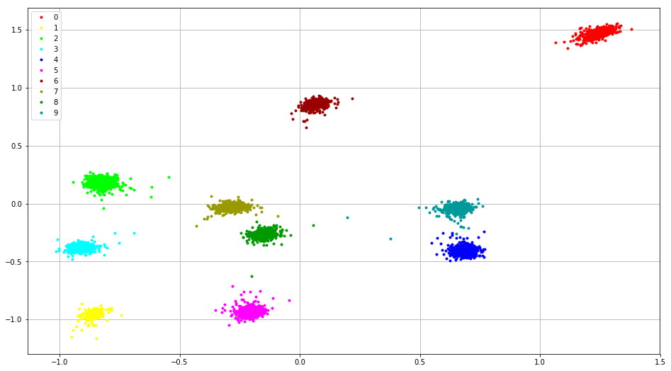
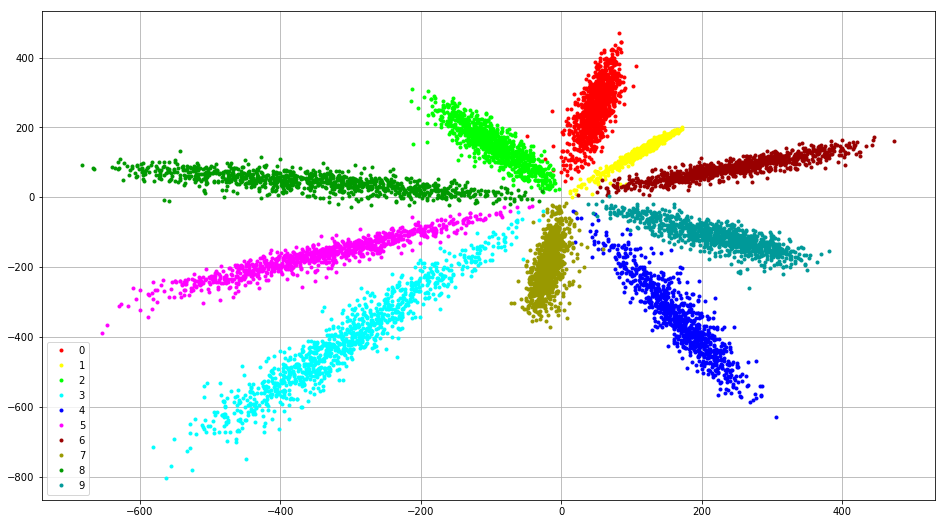

# TensorFlow_Center_Loss
Center Loss[^1] implementation with TensorFlow.

This implementation is highly inspired by [Facenet](https://github.com/davidsandberg/facenet/blob/master/src/facenet.py#L76-L88). ~~And the sample code will be uploaded soon.~~ The sample code has been uploaded.

mnist, softmax loss+center loss:

mnist, softmax loss only:

[1]: https://link.springer.com/chapter/10.1007/978-3-319-46478-7_31